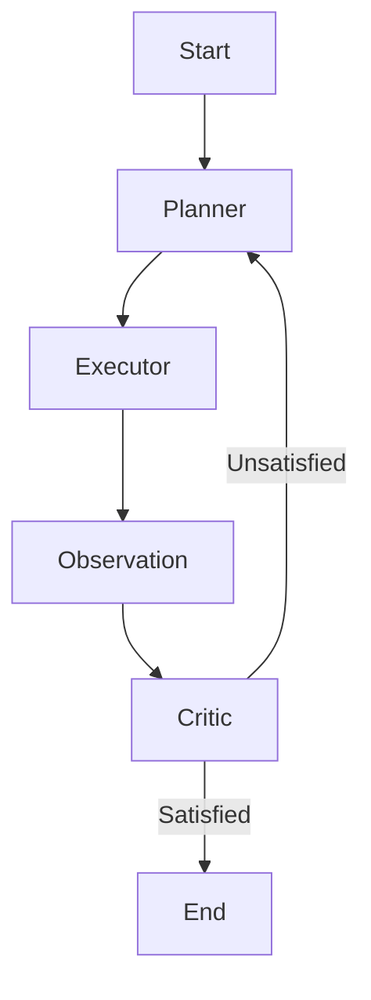

# Reverse Engineering Agent

An autonomous agentic system designed to analyze, reverse engineer, and solve binary challenges (crackmes) using static and dynamic analysis. Powered by LangGraph and multiple LLM providers.

## Features

-   **Multi-Agent Architecture**: Discrete agents for Planning, Execution, Observation, and Criticism.
-   **Interactive Binary Analysis**: Integrated `pexpect` for handling TTY-style interactive prompts in binaries.
-   **Dynamic Analysis**: GDB integration for deep inspection of program flow and memory.
-   **Multi-Provider Support**: Switch between **Groq** (fast inference) and **Google Gemini** (large context, advanced reasoning).
-   **Structured State Management**: Maintains a comprehensive state of observations, hypotheses, and artifact discoveries.
-   **Self-Correction**: The Critic agent detects circular reasoning or failures and prompts the Planner to adapt.

## Architecture

The system uses **LangGraph** to manage the lifecycle of an analysis task:



-   **Planner**: Analyzes the goal and current state to generate a sequence of tool calls.
-   **Executor**: Translates natural language steps into concrete tool inputs (e.g., GDB commands or `stdin` payloads).
-   **Observation**: Parses raw tool outputs into structured observations and updates the model of the target binary.
-   **Critic**: Evaluates progress towards the goal, identifies missing information, and determines when to terminate.

## Toolset

-   **Static**: `strings`, `file`, `hexdump`.
-   **Dynamic**: `run_binary` (via `pexpect`), `gdb`.

## Getting Started

### Prerequisites

-   [uv](https://github.com/astral-sh/uv) (for package management)
-   GCC (to compile examples)
-   GDB (for dynamic analysis)

### Installation

1.  Clone the repository:
    ```bash
    git clone https://github.com/aayush/reverse-engineering-agent.git
    cd reverse-engineering-agent
    ```

2.  Install dependencies:
    ```bash
    uv sync
    ```

3.  Configure environment:
    Create a `.env` file with your API keys:
    ```bash
    GROQ_API_KEY=your_groq_key
    GOOGLE_API_KEY=your_google_key
    ```

### Usage

Analyze a binary by providing its path and your goal:

```bash
uv run python main.py --path ./example/demo --prompt "find the secret license key" --provider gemini
```

### CLI Arguments

| Argument | Description | Default |
| :--- | :--- | :--- |
| `--path` | **Required**. Absolute or relative path to the binary. | N/A |
| `--prompt` | **Required**. The analysis goal or question. | N/A |
| `--provider` | LLM provider to use (`groq`, `gemini`). | `groq` |
| `--model` | Specific model identifier (optional). | Default for provider |

## Examples

The `example/` directory contains a sample `demo.c` challenge. You can compile and run it with:

```bash
./demo.sh
```

## Contributing

This project is a experimental prototype for agentic reverse engineering. Feel free to open issues or submit PRs to improve tool integration or agent reasoning!

---
*Built with love by aayush*
